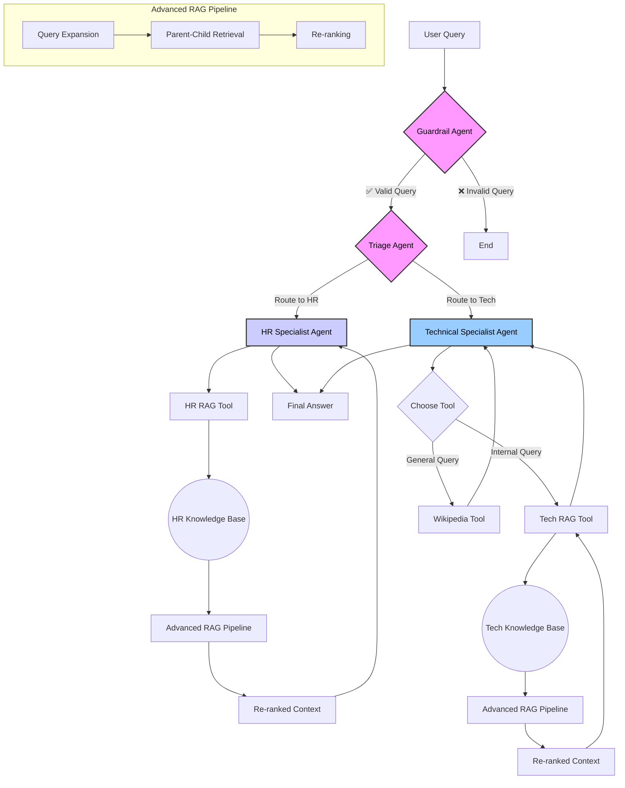

# Intelligent-Multi-Agent-Knowledge-Assistant

## Intelligent Multi-Agent RAG System

A sophisticated, multi-agent system designed to provide specialized answers from multiple knowledge bases using an advanced Retrieval-Augmented Generation (RAG) pipeline. This project demonstrates a robust architecture for building intelligent, scalable, and context-aware AI assistants.

## ✨ Key Features

  * **Multi-Agent Architecture**: The system uses a modular, agentic design with:
      * A **Guardrail Agent** to validate and scope incoming user queries.
      * A **Triage Agent** to intelligently route queries to the correct specialist.
      * Specialized **HR** and **Technical Agents** to handle domain-specific tasks.
  * **Dual RAG Pipelines**: Deploys two independent RAG knowledge bases, allowing the system to serve different departments (HR and Tech) with their own proprietary information.
  * **Advanced RAG Implementation**: Both RAG pipelines are enhanced with a multi-stage process to ensure the highest quality answers:
    1.  **Pre-Retrieval (Query Expansion)**: Automatically rewrites user queries into multiple variations to improve search recall.
    2.  **Advanced Retrieval (Parent-Child)**: Retrieves large, context-rich "parent" documents based on searches against small, specific "child" chunks.
    3.  **Post-Retrieval (Re-ranking)**: Uses `Flashrank` to re-order retrieved documents for maximal relevance before they are sent to the LLM.
  * **Dynamic Tool Use**: The Technical Agent can autonomously choose between its internal RAG tool (for company-specific info) and an external Wikipedia API tool (for general knowledge).

-----

## ⚙️ System Architecture

The project follows a sequential flow that ensures queries are validated, routed, and handled by the most appropriate agent with the best possible context.



-----

## 🔧 Technologies Used

  * **Core Framework**: LangChain
  * **LLM & Embeddings**: Google Gemini (`gemini-1.5-flash`), Google Generative AI Embeddings
  * **Vector Store**: FAISS (Facebook AI Similarity Search)
  * **Re-ranker**: Flashrank
  * **Core Language**: Python 3.10+ (`asyncio`)

-----

## 🚀 Setup and Installation

Follow these steps to get the project running locally.

### 1\. Clone the Repository

```bash
git clone https://github.com/Rupesh4604/Intelligent-Multi-Agent-Knowledge-Assistant.git
cd Intelligent-Multi-Agent-Knowledge-Assistant
```

### 2\. Create a Virtual Environment

It's recommended to use a virtual environment to manage dependencies.

```bash
python -m venv venv
source venv/bin/activate  # On Windows, use `venv\Scripts\activate`
```

### 3\. Install Dependencies

Install all the required Python packages.

```bash
pip install langchain langchain-google-genai wikipedia pydantic
pip install langchain-community faiss-cpu
pip install flashrank
```

-----

## 🔑 Configuration

You need a Google Gemini API key to run this project.

1.  Get your free API key from [Google AI Studio](https://aistudio.google.com/).

2.  Open the main Python script and locate the API key configuration section.

3.  Replace the placeholder with your actual key:

    ```python
    # Inside the script, find this section
    try:
        # from google.colab import userdata
        # os.environ['GOOGLE_API_KEY'] = userdata.get('GOOGLE_API_KEY')

        # For local development, replace the key here
        os.environ['GOOGLE_API_KEY'] = "YOUR_GEMINI_API_KEY_HERE"

        llm = ChatGoogleGenerativeAI(model="gemini-1.5-flash", temperature=0)
        llm.invoke("Test query")
        print("✅ Gemini API Key configured successfully.")
    except Exception as e:
        print(f"❌ Error configuring Gemini API: {e}")
        exit()
    ```

-----

## ▶️ Running the Project

Once the setup and configuration are complete, you can run the main script from your terminal:

```bash
python Multi_Agent.py
```

The script will execute the predefined test queries and print the entire process, including guardrail checks, triage decisions, tool usage, and final answers.

### Example Output

Here's a sample of what to expect when you run the script with an internal technical query:

```
================================================================================
👤 User Query: Where can I find the backend repo for Project Phoenix?
================================================================================
🛡️  Running Guardrail Check...
✅ Guardrail Passed.

🚦 Running Triage Agent...
🎯 Specialist selected: Technical

▶️  Invoking Technical Agent...

[Tech Tool] ➡️ Query: 'Where can I find the backend repo for Project Phoenix?'
[Tech Tool] 🔍 Expanded queries: ['What is the git repository for the Project Phoenix backend?', 'backend services repository for Project Phoenix', 'Project Phoenix backend code location']
[Tech Tool] ✨ Re-ranking 4 documents...

--------------------------------------------------------------------------------
🤖 Final Answer:
The repository for the Project Phoenix backend is git.corp.example.com/phoenix/backend-services. It is written in Python and uses the FastAPI framework.
--------------------------------------------------------------------------------
```
